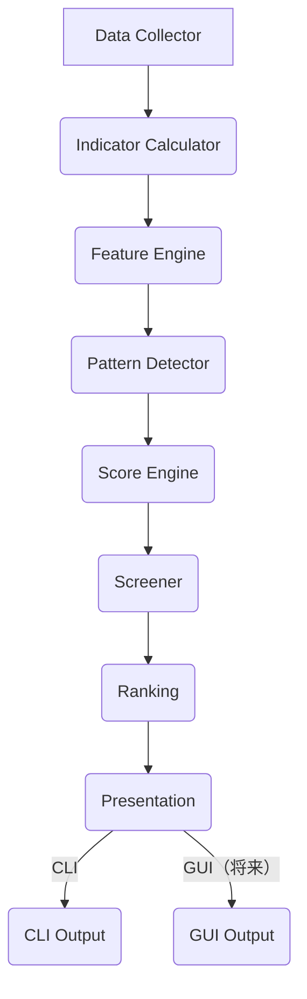

# Project Atlas 設計書

## 1. 概要
本ディレクトリは Project Atlas の設計書を管理する。

Project Atlas は、スイングトレード向け株式分析システムであり、チャート分析とファンダメンタル分析を組み合わせて株式を定量評価することを目的とする。

要件定義（Requirements）が「何を作るか」、仕様書（Specifications）が「何を評価するか」を定義するのに対し、本設計書（Design）は「どのように実装するか」を定義する。

設計書では以下を定義する。

- システムアーキテクチャ
- モジュール構成
- クラス設計
- インターフェース
- データモデル
- モジュール間の依存関係
- 処理フロー
- パラメータ設計
- 実装方針

## 2. 設計思想
Project Atlas は長期的な拡張を前提とした設計を採用する。

以下の設計原則を重視する。

- Single Responsibility Principle（単一責務）
- Low Coupling（疎結合）
- High Cohesion（高凝集）
- Extensibility（拡張性）
- Maintainability（保守性）
- Testability（テスト容易性）

また、各モジュールの責務を明確に分離し、Feature・Pattern・Score の役割を混在させない。

## 3. システム全体構成

## 4. 設計書一覧
| ファイル | 内容 |
|---|---|
| `architecture.md` | システム全体のアーキテクチャとモジュール構成 |
| `data_model.md` | 共通データモデルおよびデータ構造 |
| `indicator.md` | Indicator Calculator の設計 |
| `feature_engine.md` | Feature Engine の設計 |
| `pattern_detector.md` | Pattern Detector の設計 |
| `score_engine.md` | Score Engine の設計 |
| `directory_structure.md` | ディレクトリ構造の設計 |
| `class_design.md` | 主要クラスの設計 |
| `api_module_design.md` | APIおよびモジュール連携の設計 |

## 5. 推奨参照順
設計書は以下の順番で読むことを推奨する。

`README.md`
  ↓
`architecture.md`
  ↓
`data_model.md`
  ↓
`indicator.md`
  ↓
`feature_engine.md`
  ↓
`pattern_detector.md`
  ↓
`score_engine.md`
  ↓
`directory_structure.md`
  ↓
`class_design.md`
  ↓
`api_module_design.md`

上位の設計書ほどシステム全体に影響する内容を扱うため、下位の設計書は上位設計を前提として記述する。

## 6. 各設計書の責務

### 6.1 `architecture.md`
システム全体の構成を定義する。

**主な内容:**

- レイヤ構成
- モジュール責務
- モジュール間の依存関係
- データフロー
- ディレクトリ構成

### 6.2 `data_model.md`
システム内で利用する共通データモデルを定義する。

**主な内容:**

- OHLCV
- FinancialData
- Indicator
- FeatureResult
- PatternResult
- ScoreResult
- RankingResult

### 6.3 `indicator.md`
Indicator Calculator の設計を定義する。

**主な内容:**

- Indicator インターフェース
- 共通計算処理
- キャッシュ方針
- Indicator追加方法

Indicator は数値を計算するのみであり、評価は行わない。

### 6.4 `feature_engine.md`
Feature Engine の設計を定義する。

**主な内容:**

- Feature インターフェース
- FeatureManager
- FeatureRegistry
- FeatureResult
- 実行フロー
- Feature追加方法

Feature は市場や企業の状態を数値化することのみを担当し、投資判断は行わない。

### 6.5 `pattern_detector.md`
Pattern Detector の設計を定義する。

**主な内容:**

- Pattern インターフェース
- Detector
- PatternResult
- 検出フロー
- Pattern追加方法

Pattern Detector はチャート形状を検出するのみであり、投資判断は行わない。

### 6.6 `score_engine.md`
Score Engine の設計を定義する。

**主な内容:**

- Score構成
- 正規化
- 重み付け
- スコア算出フロー
- Ranking生成

Score Engine は Feature と Pattern を統合し、最終的な投資判断のためのスコアを算出する。

## 7. モジュール間の責務
各モジュールは単一責務を持ち、それぞれ独立して動作する。

| モジュール | 責務 |
|---|---|
| Data Collector | データ取得・保存 |
| Indicator Calculator | テクニカル指標の計算 |
| Feature Engine | 市場・企業状態の定量評価 |
| Pattern Detector | チャートパターン認識 |
| Score Engine | Feature・Pattern の統合評価 |
| Screener | 条件抽出 |
| Ranking | スコア順に並べ替え |
| Presentation | 結果表示 |

## 8. 設計上のルール
Project Atlas では以下を基本ルールとする。

- モジュール間は明確なインターフェースを介して連携する。
- データの受け渡しは共通データモデルを使用する。
- Feature・Pattern・Score の責務を混在させない。
- Indicator は評価を行わない。
- Feature は測定のみを行う。
- Pattern は検出のみを行う。
- Score Engine のみが投資判断を行う。
- 新しい Feature・Pattern・Indicator は既存コードへの影響を最小限に追加できる構造とする。

## 9. 本ディレクトリの目的
本ディレクトリは Project Atlas の実装における設計情報を一元管理することを目的とする。

設計書を参照することで、実装者がクラス構成・データ構造・処理フロー・モジュール間の依存関係を理解し、一貫性のある実装を行えることを目指す。
