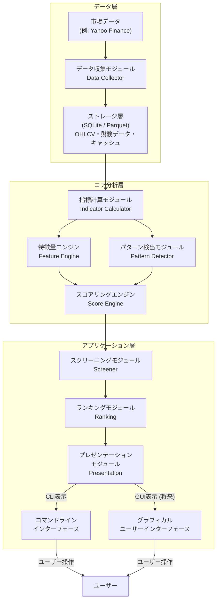

# システムアーキテクチャ設計書

## 1. 概要
本設計書は、Project Atlas のシステム全体のアーキテクチャ、モジュール構成、およびそれらの相互作用を定義する。これにより、システム全体の構造を明確にし、開発チームが共通理解のもとで開発を進めることを目的とする。

## 2. 目的
Project Atlas の高レベルなシステム設計を明確にし、各モジュールの責務と役割、およびそれらの連携方法を定義する。

## 3. 設計原則
- **疎結合・高凝集:** 各モジュールは独立性を保ち、明確な責務を持つ。モジュール間の依存関係は最小限に抑える。
- **拡張性:** 将来的な機能追加（例: GUI化、バックテスト機能、新しい分析手法）に対して柔軟に対応できるアーキテクチャとする。
- **保守性:** コードベースの理解と変更が容易になるよう、シンプルで分かりやすい構造を心がける。
- **スケーラビリティ:** 大量のデータや銘柄を扱う際に性能が劣化しないよう、モジュールレベルでの並列処理や効率的なデータアクセスを考慮する。

## 4. 全体システム構成
Project Atlas は、モジュール指向（モジュラー・モノリス）のアーキテクチャを採用する。各モジュールは単一責務を持ち、共通データモデルと明確なインターフェースを介して連携する。




### 4.1 レイヤ構造
システムは大きく以下のレイヤに分割される。

### 4.2 ディレクトリ構成

Project Atlas は、モジュール単位で責務を分離したディレクトリ構成を採用する。

```text
ProjectAtlas/
├── config/          # 設定ファイル（YAML）
├── data/            # データ保存領域
│   ├── price/       # OHLCVデータ（Parquet）
│   ├── financial/   # 財務データ（JSON）
│   └── cache/       # Indicator・Feature等のキャッシュ
├── docs/            # 要件・仕様・設計書
├── output/          # 分析結果・レポート
├── src/
│   ├── main.py      # エントリーポイント
│   ├── collector/
│   ├── indicator/
│   ├── feature/
│   ├── pattern/
│   ├── score/
│   ├── screener/
│   ├── ranking/
│   ├── presentation/
│   ├── model/       # 共通データモデル
│   ├── common/      # 共通処理
│   └── utils/       # 汎用ユーティリティ
└── tests/           # テストコード
```

各モジュールの詳細なクラス構成や内部構造は、それぞれの設計書（`indicator.md`、`feature_engine.md`、`score_engine.md` など）で定義する。本設計書では、システム全体のモジュール構成と責務の分離を示すことを目的とする。

-   **データ層 (Data Layer):** `Data Collector` が外部データソースからデータを取得し、ストレージ層へ保存する。ストレージ層には OHLCV、財務データ、および計算結果のキャッシュなどを保持する。
-   **コア分析層 (Core Analysis Layer):** `Indicator Calculator`、`Feature Engine`、`Pattern Detector`、`Score Engine` が取得されたデータを基に、テクニカル指標の計算、特徴量の抽出、チャートパターンの検出、最終的なスコアリングを行う。
-   **アプリケーション層 (Application Layer):** `Screener`、`Ranking`、`Presentation` が分析結果をユーザーに提示するためのインターフェースを提供する。スクリーニング、ランキング表示、レポート生成など。

## 5. モジュール詳細

### 5.1 Data Collector
**責務:**
-   外部API（例: 証券会社のAPI、Yahoo Finance APIなど）から株価データ（OHLCV）、出来高、財務データなどを取得する。
-   取得したデータをクリーンアップし、ストレージ層へ保存する。
-   データの更新、過去データの取得、期間指定取得などの機能を提供する。

**主要コンポーネント:**
-   `DataSourceInterface`: 異なるデータソースに対応するためのインターフェース。
-   `HistoricalDataReader`, `RealtimeDataReader` (将来):
-   `DataSaver`: 取得データを永続化するコンポーネント。

### 5.2 Indicator Calculator
**責務:**
-   Data Collector から提供される生データ（主に株価データ）を基に、移動平均線、RSI、MACDなどのテクニカル指標を計算する。
-   計算された指標は Feature Engine や Pattern Detector に提供される。

**主要コンポーネント:**
-   `IIndicator`: 各テクニカル指標の計算ロジックをカプセル化するインターフェース。
-   `IndicatorRegistry`: 利用可能なIndicatorの登録と管理。
-   `IndicatorCache`: 計算済み指標のキャッシュ機構。

### 5.3 Feature Engine
**責務:**
-   Indicator Calculator からのテクニカル指標と、Data Collector からの生データを基に、市場や企業の特性を定量的に評価する「特徴量」を算出する。
-   例: 押し目スコア、ブレイクアウトスコア、トレンドの強さなど。

**主要コンポーネント:**
-   `IFeature`: 各特徴量計算ロジックのインターフェース。
-   `FeatureManager`: 特徴量計算のオーケストレーションと結果の集約。
-   `FeatureRegistry`: 利用可能なFeatureの登録と管理。

### 5.4 Pattern Detector
**責務:**
- OHLCVデータおよび Indicator Calculator が算出したテクニカル指標を基に、チャートパターン（例: ダブルボトム、ダブルトップ、トライアングル、フラッグなど）を検出する。
- パターンの検出のみを担当し、投資判断は行わない。

**主要コンポーネント:**
-   `IPattern`: 各チャートパターン検出ロジックのインターフェース。
-   `PatternManager`: パターン検出の実行と結果の集約。
-   `PatternRegistry`: 利用可能なPatternの登録と管理。

### 5.5 Score Engine
**責務:**
- Feature Engine の特徴量と Pattern Detector の検出結果を統合し、各サブスコアおよび Total Score を算出する。
- スコアの正規化、重み付け、集計のみを担当し、銘柄の採用・除外などの最終判定は行わない。

**主要コンポーネント:**
-   `IScoreRule`: スコアリングルールのインターフェース。
-   `ScoreCalculator`: スコアの計算、重み付け、正規化。

### 5.6 Screener
**責務:**
-   Score Engine からのスコアや他の条件（流動性、株価範囲など）に基づいて、分析対象銘柄を絞り込む。

**主要コンポーネント:**
-   `ICriteria`: スクリーニング条件のインターフェース。
-   `FilterEngine`: 銘柄のフィルタリングロジック。

### 5.7 Ranking
**責務:**
-   Screener で絞り込まれた銘柄を、Score Engine からの総合スコアに基づいてランキングする。

**主要コンポーネント:**
-   `RankingGenerator`: スコアに基づくランキング生成。

### 5.8 Presentation
**責務:**
-   Ranking からの情報を、CLI または将来的な GUI を介してユーザーに表示する。
-   分析結果のレポート生成、ファイル出力機能。

**主要コンポーネント:**
-   `IReportGenerator`: レポート生成のインターフェース。
-   `CLIOutputFormatter`, `GUIOutputAdapter` (将来):

## 6. データフロー
1.  **データ取得:** `Data Collector` が市場データ（OHLCV、財務データ）を取得し、`Local Data Store` に保存する。
2.  **指標計算:** `Indicator Calculator` が `Local Data Store` から生データを読み込み、テクニカル指標を計算する。
3.  **特徴量抽出:** `Feature Engine` が `Local Data Store` の生データと `Indicator Calculator` の指標データを利用して特徴量を算出する。
4.  **パターン検出:** Pattern Detector が OHLCV データおよび Indicator を利用してチャートパターンを検出する。
5.  **スコアリング:** Score Engine が FeatureResult と PatternResult を統合し、各サブスコアと Total Score を算出する。
6.  **スクリーニング・ランキング:** Screener が Total Score に加え、流動性や価格帯などの条件も考慮して対象銘柄を抽出し、Ranking が順位付けを行う。
7.  **結果表示:** `Presentation` が最終結果をユーザーに表示する。

## 7. モジュール間の連携方法
-   **データ受け渡し:** 各モジュール間でのデータの受け渡しは、`data_model.md` で定義される共通データモデル（例: `OHLCV`, `FeatureResult`, `ScoreResult` など）を通じて行う。これにより、データの一貫性と型安全性を確保する。
-   **API/インターフェース:** モジュール間の連携は、明確に定義されたAPIまたはインターフェースを介して行う。これにより、各モジュールの内部実装が変更されても、他のモジュールへの影響を最小限に抑える。
-   **非同期処理:** 大規模なデータ処理や時間のかかる計算タスクについては、非同期処理を導入し、システムの応答性を確保することを検討する。

## 8. 技術スタック (考慮事項)
-   **プログラミング言語:** Python (データ分析ライブラリが豊富)
-   **データストレージ:** **データストレージ:** Parquet（OHLCV・キャッシュ）、JSON（財務データ）、YAML（設定ファイル）
-   **データ処理:** Pandas, NumPy
-   **可視化 (将来):** Matplotlib, Plotly (GUI化の際に検討)
-   **CLIフレームワーク:** Click, argparse

## 9. 今後の拡張性
-   **GUI化:** Presentation層をGUIに容易に切り替えられるように設計。
-   **バックテスト機能:** Score Engine の結果を利用して、過去データに基づいた売買戦略の検証機能を追加。
-   **機械学習:** Feature Engine からの特徴量を機械学習モデルの入力として利用し、より高度な予測や最適化を導入。
-   **リアルタイム処理:** Data Collector のリアルタイムデータ取得機能と連動し、分析をリアルタイムまたは準リアルタイムで行う。