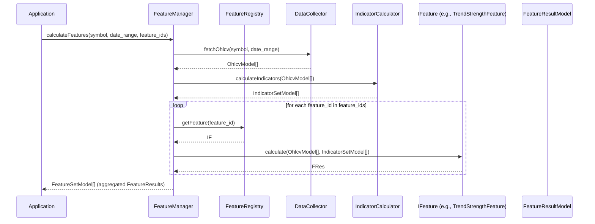

# クラス設計書

## 1. 概要
本設計書は、Project Atlas の主要なモジュールにおけるクラス設計の概要を定義する。各モジュールの詳細なクラス設計は、それぞれの設計書（例: `feature_engine.md`）で記述されているが、本設計書ではシステム全体を横断する共通の設計原則、重要な抽象クラス/インターフェース、および主要コンポーネントにおけるクラスの相互作用に焦点を当てる。

## 2. 目的
- 各モジュールにおけるクラス設計の一貫性を確保する。
- 主要なクラスとその責務、相互作用を明確にする。
- 開発者がコードベースを理解し、拡張するためのガイドラインを提供する。
- オブジェクト指向設計原則（SOLID原則など）の適用を促進する。

## 3. 設計原則
- **単一責務の原則 (SRP):** 各クラスは一つの明確な責務のみを持つ。
- **オープン・クローズドの原則 (OCP):** クラスは拡張に対して開かれ、修正に対して閉じられている。
    - 新しい特徴量、パターン、スコアリングロジックは、既存のコードを変更することなく追加できるようにする。
- **リスコフの置換原則 (LSP):** 基底クラスのオブジェクトをその派生クラスのオブジェクトで置き換えても、プログラムの振る舞いは変わらない。
    - インターフェースや抽象クラスを積極的に利用し、多態性を活用する。
- **インターフェース分離の原則 (ISP):** クライアントが利用しないインターフェースに依存させてはならない。
    - 汎用的なインターフェースではなく、特定のクライアントに必要なインターフェースのみを定義する。
- **依存関係逆転の原則 (DIP):** 抽象に依存し、具象に依存しない。
    - 上位モジュールは下位モジュールに依存せず、抽象化されたインターフェースに依存する。依存性注入 (DI) を活用する。

## 4. 主要な抽象クラスとインターフェース
各モジュールで定義される具体的なクラスは、以下の共通インターフェースまたは抽象クラスを実装/継承する。

### 4.1 `BaseConfig` (抽象クラス/設定モデル)
アプリケーション全体の設定や、各モジュール固有の設定を管理するための基底クラス。Pydanticなどの設定ライブラリを利用して実装する。

**責務:**
- 設定値の型定義とバリデーション。
- 環境変数やファイルからの設定ロード機能。

### 4.2 `IDataSource` (インターフェース)
異なるデータソース（ファイル、API、データベースなど）からデータを読み込むためのインターフェース。

**責務:**
- データの取得メソッド（例: `fetch_ohlcv`, `fetch_financial_data`）。

### 4.3 `IStorage` (インターフェース)
データを永続化（保存）するためのインターフェース。

**責務:**
- データの保存メソッド（例: `save_ohlcv`, `save_financial_data`）。

### 4.4 `IIndicator` (インターフェース)
テクニカル指標の計算ロジックを定義するインターフェース。

**責務:**
- 指標計算メソッド（例: `calculate`）。
- 指標のメタデータ（ID、名前）を提供するメソッド。

### 4.5 `IFeature` (インターフェース)
特徴量計算ロジックを定義するインターフェース。

**責務:**
- 特徴量計算メソッド（例: `calculate`）。
- 特徴量のメタデータ（ID、名前、カテゴリ）を提供するメソッド。
- 計算結果の正規化ロジック。

### 4.6 `IPattern` (インターフェース)
チャートパターン検出ロジックを定義するインターフェース。

**責務:**
- パターン検出メソッド（例: `detect`）。
- パターンのメタデータ（ID、名前、カテゴリ）を提供するメソッド。

### 4.7 `IScoreCalculator` (インターフェース)
スコア計算ロジックを定義するインターフェース。

**責務:**
- スコア計算メソッド（例: `calculate`）。
- スコアのメタデータ（ID、名前、カテゴリ）を提供するメソッド。
- 計算結果の重み付け、集計、正規化ロジック。

### 4.8 `IManager` (インターフェース/抽象クラス)
各モジュールのビジネスロジックをオーケストレーションするマネージャークラスの共通インターフェース。`FeatureManager`, `PatternManager`, `ScoreManager` などが実装する。

**責務:**
- 複数のコンポーネントを協調させて特定のタスク（例: 特徴量計算全体）を実行する。
- 依存関係の解決（DIコンテナとの連携）。

### 4.9 `IRegistry` (インターフェース/抽象クラス)
動的にコンポーネント（Feature, Pattern, Scoreなど）を登録・取得するためのレジストリクラスの共通インターフェース。

**責務:**
- コンポーネントの登録メソッド（例: `register`）。
- コンポーネントの取得メソッド（例: `get_by_id`）。

## 5. 主要モジュールにおけるクラス設計の概要

### 5.1 `config` モジュール
- `Settings(BaseSettings)`: アプリケーション全体の読み込み、データベース接続情報、APIキーなどを管理。

### 5.2 `data_collector` モジュール
- `DataCollector`: `IDataSource` と `IStorage` を利用してデータ収集と保存を orchestrate する。
- `YahooFinanceDataSource(IDataSource)`: Yahoo Finance API からデータを取得。
- `SQLiteStorage(IStorage)`: SQLite データベースへのデータ保存と取得。
- `OhlcvModel(BaseModel)`: OHLCV データのPydanticモデル。
- `FinancialModel(BaseModel)`: 財務データのPydanticモデル。

### 5.3 `indicator_calculator` モジュール
- `IndicatorCalculator`: 登録された `IIndicator` 実装を利用してテクニカル指標を計算。
- `MovingAverage(IIndicator)`: 移動平均線を計算する具体的なクラス。
- `RSI(IIndicator)`: RSI を計算する具体的なクラス。
- `IndicatorRegistry(IRegistry)`: `IIndicator` 実装を管理。
- `IndicatorSetModel(BaseModel)`: 計算された指標のPydanticモデル。

### 5.4 `feature_engine` モジュール
- `FeatureManager(IManager)`: `IDataSource`, `IIndicator`, `IFeature` を利用して特徴量計算を管理。
- `FeatureRegistry(IRegistry)`: `IFeature` 実装を管理。
- `TrendStrengthFeature(IFeature)`: トレンド強度を計算する具体的なクラス。
- `PullbackScoreFeature(IFeature)`: 押し目評価を計算する具体的なクラス。
- `FeatureResultModel(BaseModel)`: 特徴量計算結果のPydanticモデル。
- `FeatureSetModel(BaseModel)`: 複数の特徴量結果をまとめるPydanticモデル。

### 5.5 `pattern_detector` モジュール
- `PatternManager(IManager)`: `IDataSource`, `IIndicator`, `IPattern` を利用してパターン検出を管理。
- `PatternRegistry(IRegistry)`: `IPattern` 実装を管理。
- `DoubleBottomDetector(IPattern)`: ダブルボトムパターンを検出する具体的なクラス。
- `HeadAndShouldersDetector(IPattern)`: ヘッドアンドショルダーズパターンを検出する具体的なクラス。
- `PatternResultModel(BaseModel)`: パターン検出結果のPydanticモデル。
- `PatternSetModel(BaseModel)`: 複数のパターン検出結果をまとめるPydanticモデル。

### 5.6 `score_engine` モジュール
- `ScoreManager(IManager)`: `IFeature`, `IPattern`, `IScoreCalculator` を利用してスコア計算を管理。
- `ScoreRegistry(IRegistry)`: `IScoreCalculator` 実装を管理。
- `OverallScoreCalculator(IScoreCalculator)`: 総合スコアを計算する具体的なクラス。
- `TrendFollowingScoreCalculator(IScoreCalculator)`: トレンドフォロー戦略に基づくスコアを計算する具体的なクラス。
- `ScoreResultModel(BaseModel)`: スコア計算結果のPydanticモデル。

### 5.7 `screener` モジュール
- `Screener`: `ScoreResultModel` を利用して銘柄をフィルタリング。
- `ICriteria`: スクリーニング条件のインターフェース。
- `PriceRangeCriteria(ICriteria)`: 価格範囲でフィルタリングする具体的なクラス。

### 5.8 `ranking` モジュール
- `RankingGenerator`: `ScoreResultModel` を利用して銘柄をランキング。
- `AnalysisResultModel(BaseModel)`: 最終分析結果のPydanticモデル。

### 5.9 `presentation` モジュール
- `PresentationController`: `AnalysisResultModel` を受け取り、ユーザーインターフェースに表示。
- `CLIOutputFormatter`: CLI形式で結果を出力。
- `GUIOutputAdapter` (将来): GUI形式で結果を出力。

### 5.10 `utils` モジュール
- `DateConverter`: 日付フォーマット変換ユーティリティ。
- `MathHelper`: 数学計算ユーティリティ。

## 6. クラス間の相互作用 (例: Feature Engine)

## 7. テスト観点
- 各クラスの単一責務が守られているか。
- インターフェースを実装するクラスが期待通りの振る舞いをするか。
- マネージャークラスが依存するコンポーネントを適切に利用し、オーケストレーションできているか。
- 依存性注入が適切に機能しているか。
- データの入出力とバリデーションが正確に行われるか。