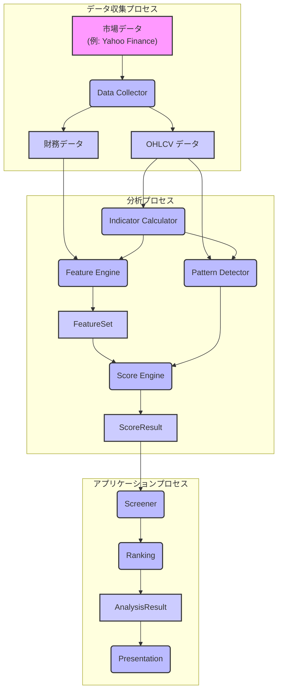
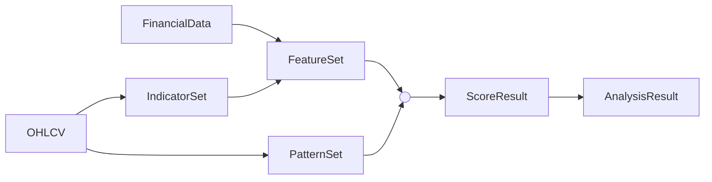

# Data Model 設計書

## 1. 目的

本設計書では、Project Atlas で利用する共通データモデルを定義する。

各モジュールは共通データモデルを介してデータを受け渡し、モジュール間の結合度を低減する。

本設計書では実装クラスではなく、論理的なデータ構造を定義する。

---

## 2. 設計方針

- モジュール間は共通データモデルのみを受け渡す。
- モジュール間で内部実装を参照しない。
- Feature・Pattern・Score は Result オブジェクトで表現する。
- データモデルは実装言語に依存しない。
- 拡張時も既存モデルを壊さないことを優先する。

---

## 3. データモデル一覧

| データモデル | 説明 |
|--------------|------|
| OHLCV | 株価・出来高データ |
| FinancialData | 財務データ |
| IndicatorSet | テクニカル指標 |
| FeatureSet | FeatureResult の集合 |
| PatternSet | PatternResult の集合 |
| FeatureResult | Feature算出結果 |
| PatternResult | Pattern検出結果 |
| ScoreResult | スコア算出結果 |
| AnalysisResult | 最終分析結果 |

---

## 4. データフロー (DFD)

---

## 5. 各データモデル

### 5.1 OHLCV

保持する市場データ。

| フィールド | 型 | 説明 |
|------------|----|------|
| symbol | string | 銘柄コード |
| date | date | 取引日 |
| open | float | 始値 |
| high | float | 高値 |
| low | float | 安値 |
| close | float | 終値 |
| volume | integer | 出来高 |

**代表項目:**
- `date`
- `open`
- `high`
- `low`
- `close`
- `volume`

**入力元:** Data Collector

**利用先:**
- Indicator Calculator
- Feature Engine
- Pattern Detector

### 5.2 FinancialData
企業の財務情報を保持する。

| フィールド | 型 | 説明 |
|------------|----|------|
| symbol | string | 銘柄コード |
| fiscal_date | date | 決算日 |
| eps | float | EPS |
| bps | float | BPS |
| roe | float | ROE |
| roa | float | ROA |
| per | float | PER |
| pbr | float | PBR |
| revenue | float | 売上高 |
| operating_profit | float | 営業利益 |
| net_profit | float | 純利益 |

**代表項目:**
- `EPS`
- `BPS`
- `ROE`
- `ROA`
- `PER`
- `PBR`
- `売上高`
- `営業利益`
- `純利益`

**入力元:** Data Collector

**利用先:**
- Feature Engine

### 5.3 IndicatorSet
Indicator Calculator が算出したテクニカル指標を保持する。

| フィールド | 型 | 説明 |
|------------|----|------|
| symbol | string | 銘柄コード |
| date | date | 対象日 |
| indicators | map<string, any> | Indicator名と値（単一値・複合値）の集合 |

**例:**
- `MA5`
- `MA25`
- `MA75`
- `RSI`
- `ATR`
- `MACD`
- `ROC`
- `Bollinger Bands`
- `出来高平均`

※ MACD や Bollinger Bands のような複数値を持つ Indicator に対応するため、値は単一値・複合値の両方を保持できるものとする。

**利用先:**
- Feature Engine
- Pattern Detector

### 5.4 FeatureResult
Feature Engine が算出した特徴量を保持する。

| フィールド | 型 | 説明 |
|------------|----|------|
| feature_id | string | Feature識別子 |
| feature_name | string | Feature名 |
| score | float | 正規化後スコア |
| raw_value | float | 元の計算値 |
| metadata | map<string, any> | 補足情報 |

各 Feature は識別子・スコア・補足情報を持つ。

**利用先:**
- Score Engine

### 5.5 FeatureSet
FeatureResult の集合を保持する。

| フィールド | 型 | 説明 |
|------------|----|------|
| symbol | string | 銘柄コード |
| date | date | 評価対象日 |
| results | list<FeatureResult> | FeatureResult の一覧 |

Feature Engine は複数の Feature を評価し、その結果を FeatureSet として返却する。

**利用先:**
- Score Engine

### 5.6 PatternResult
Pattern Detector が検出したチャートパターンを保持する。

| フィールド | 型 | 説明 |
|------------|----|------|
| pattern_id | string | Pattern識別子 |
| pattern_name | string | Pattern名 |
| confidence | float | 検出信頼度 |
| metadata | map<string, any> | 補足情報 |

各 Pattern は名称・信頼度・補足情報を持つ。

**利用先:**
- Score Engine

### 5.7 PatternSet
PatternResult の集合を保持する。

| フィールド | 型 | 説明 |
|------------|----|------|
| symbol | string | 銘柄コード |
| date | date | 評価対象日 |
| results | list<PatternResult> | PatternResult の一覧 |

Pattern Detector は複数のチャートパターンを検出し、その結果を PatternSet として返却する。

**利用先:**
- Score Engine

### 5.8 ScoreResult
Score Engine が算出したサブスコアおよび Total Score を保持する。

| フィールド | 型 | 説明 |
|------------|----|------|
| sub_scores | map<string, float> | サブスコア |
| total_score | float | 総合スコア |
| metadata | map<string, any> | スコア補足情報 |

**代表項目:**
- `Trend Score`
- `Pullback Score`
- `Breakout Score`
- `Risk Score`
- `Fundamental Score`
- `Total Score`

**利用先:**
- Screener
- Ranking

### 5.9 AnalysisResult
アプリケーション全体で利用する最終分析結果。Presentation 層は本データモデルを利用して表示を行う。

| フィールド | 型 | 説明 |
|------------|----|------|
| symbol | string | 銘柄コード |
| company_name | string | 銘柄名 |
| total_score | float | 総合スコア |
| feature_results | list<FeatureResult> | Feature結果 |
| pattern_results | list<PatternResult> | Pattern結果 |
| rank | integer | ランク |
| summary | string | 分析サマリ（任意） |

**代表項目:**
- 銘柄コード
- 銘柄名
- Total Score
- サブスコア
- 検出パターン
- Feature概要
- ランク

**利用先:**
- Presentation

## 5.10 データモデル設計ルール

- データモデルは不変オブジェクトとして扱うことを推奨する。
- モジュールは必要最小限のデータのみ参照する。
- データモデルは論理構造であり、保存形式や実装クラスとは独立する。
- 新規フィールド追加時は既存フィールドとの互換性を維持する。
- Set モデルは評価対象銘柄と評価日時を保持し、関連する Result を集約する。

## 6. 設計ルール

- モジュール間はデータモデルのみを受け渡す。
- Feature Engine は FeatureResult を生成し、それらを FeatureSet として返却する。
- Pattern Detector は PatternResult を生成し、それらを PatternSet として返却する。
- Score Engine は FeatureSet と PatternSet を入力として ScoreResult を生成する。
- Presentation は AnalysisResult のみを利用する。

## 7. データモデルライフサイクル

各データモデルは生成・利用・破棄のライフサイクルを持つ。本章では、各モデルの生成元、利用先、および永続化方針を定義する。

| データモデル | 生成元 | 主な利用先 | 永続化 |
|--------------|--------|------------|--------|
| OHLCV | Data Collector | Indicator Calculator, Feature Engine, Pattern Detector | ○ |
| FinancialData | Data Collector | Feature Engine | ○ |
| IndicatorSet | Indicator Calculator | Feature Engine, Pattern Detector | △（キャッシュ可） |
| FeatureSet | Feature Engine | Score Engine | △（キャッシュ可） |
| PatternSet | Pattern Detector | Score Engine | △（キャッシュ可） |
| ScoreResult | Score Engine | Screener, Ranking | × |
| AnalysisResult | Ranking | Presentation | × |

### ライフサイクル概要

### 永続化方針

- **○（永続化）**: ローカルストレージへ保存し、次回以降も再利用する。
- **△（キャッシュ可）**: 再計算コスト削減のため、必要に応じてキャッシュする。
- **×（非永続化）**: 実行中のみ利用する一時的なデータモデルとする。

## 8. 今後の拡張

将来的に以下のデータモデルを追加可能とする。

- TradeSignal
- Portfolio
- BacktestResult
- Alert
- WatchList
