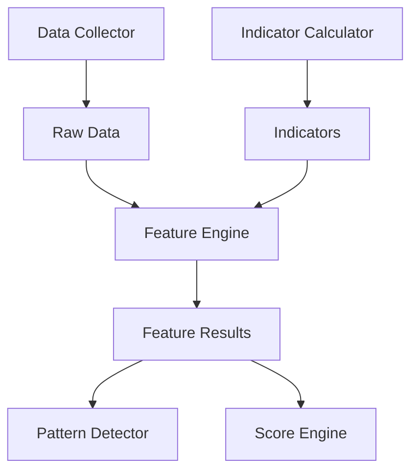

# Feature Engine 設計書

## 1. 概要
Feature Engine は、Data Collector から取得した生データと Indicator Calculator から算出されたテクニカル指標を基に、市場や企業の特性を定量的に評価する「特徴量」を算出する責務を持つ。

## 2. 目的
本設計書の目的は、Feature Engine のアーキテクチャ、モジュール構成、主要なクラス設計、処理フロー、および特徴量の追加方法を定義することである。

## 3. 設計原則
- **単一責務の徹底:** 各特徴量計算ロジックは、独立したモジュールとして実装し、特定の市場または企業状態の測定のみに責任を持つ。
- **疎結合:** Feature Engine は、Data Collector や Indicator Calculator からの入力データ形式、および Pattern Detector や Score Engine への出力データ形式にのみ依存し、各モジュールの内部実装には依存しない。
- **高い拡張性:** 新しい特徴量を容易に追加できるよう、共通インターフェースに基づいたプラグイン可能なアーキテクチャを採用する。
- **テスト容易性:** 各特徴量計算ロジックは独立してテスト可能とする。

## 4. システム構成

## 5. 主要コンポーネント
### 5.1 `IFeature` インターフェース
すべての特徴量クラスが実装すべき共通インターフェースを定義する。これにより、Feature Engine は個々の特徴量の実装に依存せず、統一的な方法で特徴量を処理できる。

**責務:**
- 特定の特徴量を計算する `calculate` メソッドの定義。
- 特徴量のメタデータ（ID、名前、カテゴリなど）を提供するメソッドの定義。

### 5.2 `FeatureManager`
システム内のすべての特徴量を管理し、指定された銘柄に対して特徴量計算を実行する責務を持つ。

**責務:**
- `IFeature` を実装する特徴量クラスの登録・管理。
- `FeatureRegistry` を介して登録された特徴量を取得し、計算をオーケストレーションする。
- 特徴量計算の実行順序を管理する（依存関係があれば考慮する）。

### 5.3 `FeatureRegistry`
利用可能なすべての特徴量クラスの登録と取得を行うレジストリパターンを実装する。これにより、Feature Engine のコアロジックから具体的な特徴量クラスの実装を分離する。

**責務:**
- `IFeature` を実装するクラスを動的に登録する。
- Feature ID に基づいて特定の特徴量クラスのインスタンスを提供する。

### 5.4 `FeatureCalculator` (具体的な特徴量クラス)
`IFeature` インターフェースを実装し、特定の市場または企業状態を定量化する具体的な計算ロジックを提供する。

**責務:**
- 独自の計算ロジックに基づいて特徴量を算出する。
- 算出された特徴量を0〜100の範囲で正規化するロジックを含む。
- 必要な入力データ（OHLCV、テクニカル指標など）を受け取る。

### 5.5 `FeatureResult`
計算された特徴量の結果を格納するデータモデル。特徴量ID、値、評価日などの情報を含む。

## 6. 処理フロー
1.  **特徴量登録:** アプリケーション起動時に、すべての `IFeature` 実装クラスが `FeatureRegistry` に登録される。
2.  **計算リクエスト:** `FeatureManager` は、特定の銘柄と期間に対して特徴量計算リクエストを受け取る。
3.  **データ取得:** `FeatureManager` は、`Data Collector` と `Indicator Calculator` から必要な生データおよびテクニカル指標を取得する。
4.  **特徴量計算の実行:** `FeatureManager` は `FeatureRegistry` から必要な `FeatureCalculator` インスタンスを取得し、`calculate` メソッドを呼び出す。
5.  **結果の正規化:** 各 `FeatureCalculator` は、計算結果を0〜100の範囲で正規化し、`FeatureResult` オブジェクトとして返す。
6.  **結果集約:** `FeatureManager` は、すべての `FeatureResult` を集約し、`Pattern Detector` や `Score Engine` へ渡すための形式で出力する。

## 7. 特徴量追加方法
新しい特徴量を追加するには、以下の手順に従う。

1.  **特徴量仕様書の作成:** `docs/specifications/features/` ディレクトリ配下に、新しい特徴量の仕様書（`docs/specifications/features/<カテゴリ>/<Feature ID>_<FeatureName>.md`）を作成する。
2.  **`IFeature` の実装:** `IFeature` インターフェースを実装する新しいクラスを作成し、`calculate` メソッドに計算ロジックと正規化ロジックを記述する。
3.  **`FeatureRegistry` への登録:** 新しく作成した特徴量クラスを `FeatureRegistry` に登録する設定を追加する（自動登録メカニズムも検討）。
4.  **テストコードの作成:** 新しい特徴量に対する単体テストを作成する。

## 8. テスト観点
- 各 `FeatureCalculator` が期待通りに特徴量を計算し、正規化できること。
- データ不足や不正なデータが入力された場合のエラーハンドリングが適切であること。
- `FeatureManager` が複数の特徴量を正しくオーケストレーションできること。
- 新しい特徴量の追加が既存システムに影響を与えないこと。
