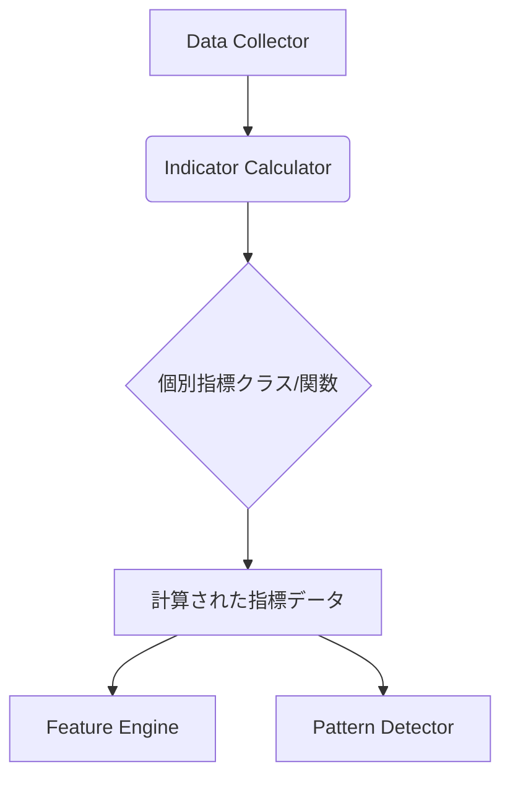

# インジケーター設計

## 1. 概要

インジケーターモジュールは、金融市場データ（OHLCV）から様々なテクニカル指標を計算し、提供することを責務とします。これにより、他のモジュール（例：特徴量エンジン、パターン検出器）が分析に必要な基礎データに容易にアクセスできるようになります。

## 2. ゴール

- 効率的かつ正確なテクニカル指標の計算。
- 拡張性のあるアーキテクチャにより、新しい指標の追加を容易にする。
- 計算された指標を一貫した形式で提供する。

## 3. 主要コンポーネント

### 3.1. `IndicatorCalculator`

- **責務**: 生の市場データ（OHLCV）を受け取り、指定されたテクニカル指標を計算する。
- **入力**: OHLCVデータ（pandas DataFrame形式を想定）、指標の種類、期間などのパラメータ。
- **出力**: 計算された指標値（pandas DataFrame形式を想定）。
- **主要メソッド**:
    - `calculate(data: pd.DataFrame, indicator_type: str, params: Dict) -> pd.DataFrame`
        - 指定された指標タイプとパラメータに基づいて指標を計算する。
    - `get_available_indicators() -> List[str]`
        - 利用可能なテクニカル指標のリストを返す。
    - `get_indicator_parameters(indicator_type: str) -> Dict`
        - 特定の指標タイプに必要なパラメータ情報を返す。

### 3.2. 個別指標クラス/関数

- **責務**: 各テクニカル指標の具体的な計算ロジックをカプセル化する。
- **例**: `MovingAverage`, `RSI`, `BollingerBands` など。
- **設計思想**: 新しい指標を追加する際、既存のコードに大きな変更を加えることなく、新しいクラス/関数を追加するだけで対応できるようにする（オープン/クローズドの原則）。

### 3.3. 設定とパラメータ管理

- **責務**: 各指標の計算に必要なパラメータ（期間、種類など）を管理する。
- **実装**: 設定ファイル（YAML/JSON）またはデータベースを通じて管理することを検討。これにより、指標のパラメータを柔軟に変更できるようになる。

## 4. データフロー

1. Data Collector から生のOHLCVデータが提供される。
2. IndicatorCalculator がOHLCVデータと必要な指標パラメータを受け取る。
3. IndicatorCalculator は、各個別指標クラス/関数を呼び出し、指標を計算する。
4. 計算された指標データは、Feature Engine や Pattern Detector などの後続モジュールに渡される。

## 5. 技術的考慮事項

- **パフォーマンス**: 大量の時系列データを扱うため、NumPyやPandasなどの数値計算ライブラリを最大限に活用し、計算効率を最適化する。
- **エラーハンドリング**: 無効な入力データや計算エラーが発生した場合の堅牢なエラーハンドリング機構を設計する。
- **テスト**: 各指標の計算ロジックが正確であることを保証するために、包括的な単体テストを実施する。

## 6. 今後の課題

- どのようなテクニカル指標を優先的に実装するか（RSI, MACD, Bollinger Bands, 移動平均線など）。
- パラメータの最適化戦略（例：バックテスト、機械学習を用いた最適化）。
- リアルタイムデータへの対応可否。