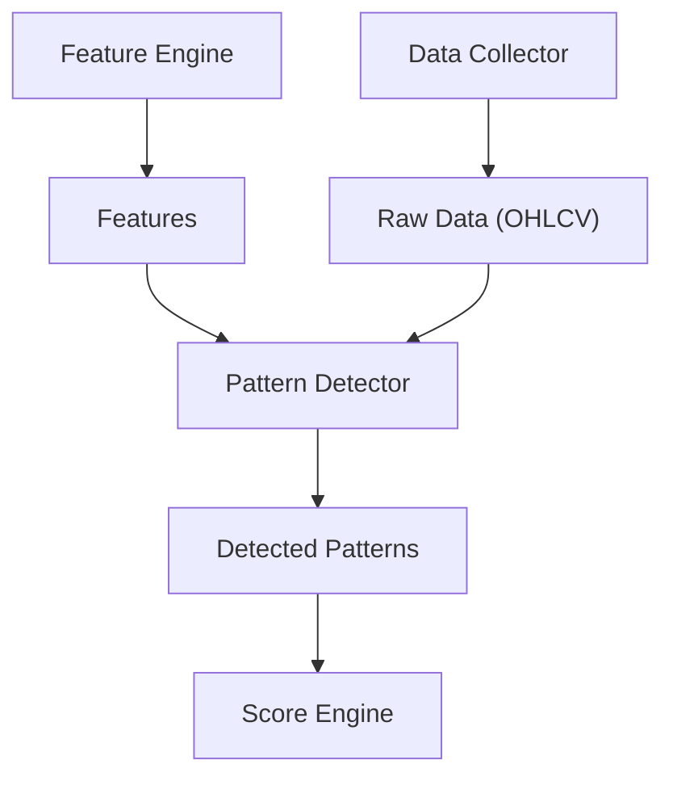

# Pattern Detector 設計書

## 1. 概要
Pattern Detector は、Feature Engine から提供される特徴量や生データ（OHLCV）を基に、市場における特定の価格パターン（例：ダブルボトム、ヘッドアンドショルダーズ）を識別する責務を持つ。

## 2. 目的
本設計書の目的は、Pattern Detector のアーキテクチャ、モジュール構成、主要なクラス設計、処理フロー、および新しいパターンの追加方法を定義することである。

## 3. 設計原則
- **単一責務の徹底:** 各パターン検出ロジックは、独立したモジュールとして実装し、特定のパターン検出のみに責任を持つ。
- **疎結合:** Pattern Detector は、Feature Engine からの入力データ形式、および Score Engine への出力データ形式にのみ依存し、各モジュールの内部実装には依存しない。
- **高い拡張性:** 新しいパターンを容易に追加できるよう、共通インターフェースに基づいたプラグイン可能なアーキテクチャを採用する。
- **テスト容易性:** 各パターン検出ロジックは独立してテスト可能とする。

## 4. システム構成

## 5. 主要コンポーネント
### 5.1 `IPattern` インターフェース
すべてのパターン検出クラスが実装すべき共通インターフェースを定義する。これにより、Pattern Detector は個々のパターン実装に依存せず、統一的な方法でパターンを処理できる。

**責務:**
- 特定のパターンを検出する `detect` メソッドの定義。
- パターンのメタデータ（ID、名前、カテゴリなど）を提供するメソッドの定義。

### 5.2 `PatternManager`
システム内のすべてのパターンを管理し、指定された銘柄に対してパターン検出を実行する責務を持つ。

**責務:**
- `IPattern` を実装するパターンクラスの登録・管理。
- `PatternRegistry` を介して登録されたパターンを取得し、検出をオーケストレーションする。
- パターン検出の実行順序を管理する（依存関係があれば考慮する）。

### 5.3 `PatternRegistry`
利用可能なすべてのパターンクラスの登録と取得を行うレジストリパターンを実装する。これにより、Pattern Detector のコアロジックから具体的なパターンクラスの実装を分離する。

**責務:**
- `IPattern` を実装するクラスを動的に登録する。
- Pattern ID に基づいて特定のパターンクラスのインスタンスを提供する。

### 5.4 `PatternDetector` (具体的なパターン検出クラス)
`IPattern` インターフェースを実装し、特定の価格パターンを識別する具体的なロジックを提供する。

**責務:**
- 独自のロジックに基づいてパターンを検出する。
- 検出されたパターンの開始日、終了日、信頼度などの情報を含む `PatternResult` オブジェクトを生成する。
- 必要な入力データ（OHLCV、特徴量など）を受け取る。

### 5.5 `PatternResult`
検出されたパターンの結果を格納するデータモデル。パターンID、検出日、信頼度、関連する価格データなどの情報を含む。

## 6. 処理フロー
1.  **パターン登録:** アプリケーション起動時に、すべての `IPattern` 実装クラスが `PatternRegistry` に登録される。
2.  **検出リクエスト:** `PatternManager` は、特定の銘柄と期間に対してパターン検出リクエストを受け取る。
3.  **データ取得:** `PatternManager` は、`Feature Engine` から特徴量、および必要に応じて `Data Collector` から生データ（OHLCV）を取得する。
4.  **パターン検出の実行:** `PatternManager` は `PatternRegistry` から必要な `PatternDetector` インスタンスを取得し、`detect` メソッドを呼び出す。
5.  **結果生成:** 各 `PatternDetector` は、検出されたパターンを `PatternResult` オブジェクトとして返す。
6.  **結果集約:** `PatternManager` は、すべての `PatternResult` を集約し、`Score Engine` へ渡すための形式で出力する。

## 7. パターン追加方法
新しいパターンを追加するには、以下の手順に従う。

1.  **パターン仕様書の作成:** `docs/specifications/patterns/` ディレクトリ配下に、新しいパターンの仕様書（`docs/specifications/patterns/<カテゴリ>/<Pattern ID>_<PatternName>.md`）を作成する。
2.  **`IPattern` の実装:** `IPattern` インターフェースを実装する新しいクラスを作成し、`detect` メソッドに検出ロジックを記述する。
3.  **`PatternRegistry` への登録:** 新しく作成したパターンクラスを `PatternRegistry` に登録する設定を追加する（自動登録メカニズムも検討）。
4.  **テストコードの作成:** 新しいパターンに対する単体テストを作成する。

## 8. テスト観点
- 各 `PatternDetector` が期待通りにパターンを検出できること。
- データ不足や不正なデータが入力された場合のエラーハンドリングが適切であること。
- `PatternManager` が複数のパターンを正しくオーケストレーションできること。
- 新しいパターンの追加が既存システムに影響を与えないこと。