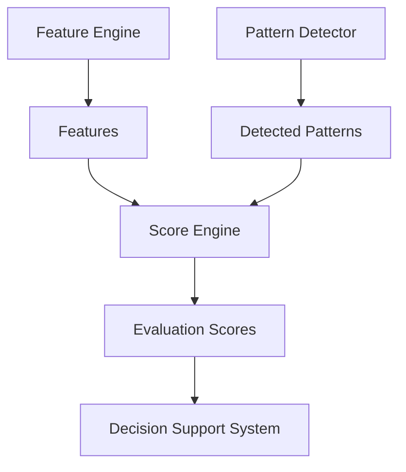

# Score Engine 設計書

## 1. 概要
Score Engine は、Feature Engine から提供される特徴量と Pattern Detector から提供される検出パターンを基に、銘柄の総合的な評価スコアを算出する責務を持つ。このスコアは、投資判断の補助情報として利用される。

## 2. 目的
本設計書の目的は、Score Engine のアーキテクチャ、モジュール構成、主要なクラス設計、処理フロー、およびスコアリングロジックの追加方法を定義することである。

## 3. 設計原則
- **柔軟なスコアリングロジック:** 異なる投資戦略や評価基準に対応できるよう、柔軟にスコアリングロジックを定義・変更できる構造とする。
- **透明性と説明責任:** 各スコアの算出根拠を明確にし、どの特徴量やパターンがスコアに影響を与えたかを追跡できるようにする。
- **高い拡張性:** 新しいスコアリングロジックや評価項目を容易に追加できるよう、共通インターフェースに基づいたプラグイン可能なアーキテクチャを採用する。
- **テスト容易性:** 各スコアリングロジックは独立してテスト可能とする。

## 4. システム構成

## 5. 主要コンポーネント
### 5.1 `IScoreCalculator` インターフェース
すべてのスコア計算クラスが実装すべき共通インターフェースを定義する。これにより、Score Engine は個々のスコア計算実装に依存せず、統一的な方法でスコアを処理できる。

**責務:**
- 特定のスコアを計算する `calculate` メソッドの定義。
- スコアのメタデータ（ID、名前、カテゴリなど）を提供するメソッドの定義。

### 5.2 `ScoreManager`
システム内のすべてのスコアリングロジックを管理し、指定された銘柄に対してスコア計算を実行する責務を持つ。

**責務:**
- `IScoreCalculator` を実装するスコア計算クラスの登録・管理。
- `ScoreRegistry` を介して登録されたスコア計算ロジックを取得し、計算をオーケストレーションする。
- スコア計算の実行順序を管理する（依存関係があれば考慮する）。

### 5.3 `ScoreRegistry`
利用可能なすべてのスコア計算クラスの登録と取得を行うレジストリパターンを実装する。これにより、Score Engine のコアロジックから具体的なスコア計算クラスの実装を分離する。

**責務:**
- `IScoreCalculator` を実装するクラスを動的に登録する。
- Score ID に基づいて特定のスコア計算クラスのインスタンスを提供する。

### 5.4 `BaseScoreCalculator` (具体的なスコア計算クラス)
`IScoreCalculator` インターフェースを実装し、特定の特徴量やパターンを組み合わせて総合スコアを算出する具体的なロジックを提供する。

**責務:**
- 独自のロジックに基づいてスコアを算出する。
- 算出されたスコアを0〜100の範囲で正規化するロジックを含む。
- 必要な入力データ（特徴量、検出パターンなど）を受け取る。

### 5.5 `ScoreResult`
計算されたスコアの結果を格納するデータモデル。スコアID、値、評価日、関連する特徴量やパターンの重み付けなどの情報を含む。

## 6. 処理フロー
1.  **スコア登録:** アプリケーション起動時に、すべての `IScoreCalculator` 実装クラスが `ScoreRegistry` に登録される。
2.  **計算リクエスト:** `ScoreManager` は、特定の銘柄と期間に対してスコア計算リクエストを受け取る。
3.  **データ取得:** `ScoreManager` は、`Feature Engine` から特徴量、および `Pattern Detector` から検出パターンを取得する。
4.  **スコア計算の実行:** `ScoreManager` は `ScoreRegistry` から必要な `BaseScoreCalculator` インスタンスを取得し、`calculate` メソッドを呼び出す。
5.  **結果生成:** 各 `BaseScoreCalculator` は、計算結果を `ScoreResult` オブジェクトとして返す。
6.  **結果集約:** `ScoreManager` は、すべての `ScoreResult` を集約し、`Decision Support System` へ渡すための形式で出力する。

## 7. スコアリングロジック追加方法
新しいスコアリングロジックを追加するには、以下の手順に従う。

1.  **スコア仕様書の作成:** `docs/specifications/scoreing.md` を更新し、新しいスコアの定義と計算方法を追記する。
2.  **`IScoreCalculator` の実装:** `IScoreCalculator` インターフェースを実装する新しいクラスを作成し、`calculate` メソッドに計算ロジックと正規化ロジックを記述する。
3.  **`ScoreRegistry` への登録:** 新しく作成したスコアクラスを `ScoreRegistry` に登録する設定を追加する（自動登録メカニズムも検討）。
4.  **テストコードの作成:** 新しいスコアに対する単体テストを作成する。

## 8. テスト観点
- 各 `BaseScoreCalculator` が期待通りにスコアを計算し、正規化できること。
- データ不足や不正なデータが入力された場合のエラーハンドリングが適切であること。
- `ScoreManager` が複数のスコアリングロジックを正しくオーケストレーションできること。
- 新しいスコアリングロジックの追加が既存システムに影響を与えないこと。